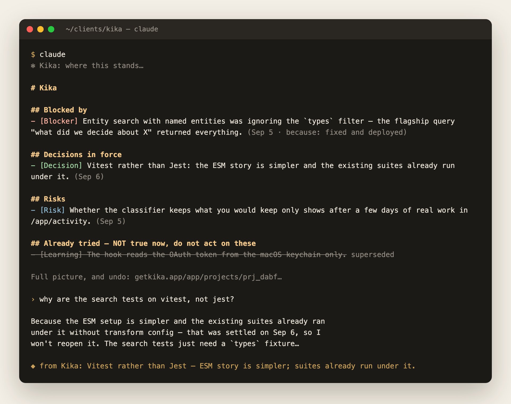

# Kika for Claude Code

Kika gives a project one memory that every agent and every person on it reads.
What was decided and why, what is blocked, what was promised and by when, what
was already tried and dropped. None of that is in the repository, and an agent
cannot infer it from the code.



One install gives you both halves:

- **the MCP server** — `get_brief`, `search_memory`, `remember`,
  `update_memory`, `close_loop`, so an agent can read the project's memory and
  add to it; and
- **the capture hook** — which records what a turn settled without the agent
  having to remember to.

The hook is the part no other memory product has. A handshake that says "write
things down when they matter" is advice, and a model under load ignores advice.
A hook is not advice.

## Install

```
/plugin marketplace add usekika/kika-plugin
/plugin install kika@kika
```

Then `/mcp`, choose kika, and approve in the browser.

That is the whole install. The plugin carries both halves, so there is nothing
to clone, no script to run, and no second credential: the hook reads the OAuth
token Claude Code already holds for this server and keeps refreshed.

Projects create themselves the first time something worth remembering is said
in a repository. There is nothing to set up per project.

### With a token instead

For CI, or a machine with no browser. Get one at **getkika.app/app/connect**:

```
claude mcp add --scope user --transport http kika https://api.getkika.app/mcp \
  --header "Authorization: Bearer kika_mcp_…"
```

`--scope user` matters: without it the server is bound to the one project you
happened to be in. The hook reads that same header out of your MCP
configuration, so it is still one credential.

### Platform note

The OAuth path is verified on macOS, where Claude Code keeps the token in the
login keychain. Elsewhere the hook looks for `~/.claude/.credentials.json`
first, which may or may not be where your build stores it. If capture is silent
on Linux or Windows, use the `--header` form above.

## For a teammate

They install the same way and sign in as themselves. What they do in their own
repositories is their own memory.

To put them on a project of yours, add them at **getkika.app/app/projects** —
the project, then **People**, then the email address they sign in with. They do
not need an account first; the invitation waits and is claimed the first time
they sign in.

From then on their checkout of that repository resolves to *your* project rather
than a second copy of it: what they decide, you read, and every fact shows who
recorded it and from which branch. Everyone on a project can read and write its
memory; only the owner decides who else is on it.

Until you add them, a repository that already belongs to a project is refused
rather than duplicated. The agent is told the project exists, that they are not
on it, and that whoever set it up can add them.

## What leaves your machine

When a finished turn looks like it settled something, the hook posts to
`https://api.getkika.app/hooks/turn`:

- the last assistant message (at most 8,000 characters) and the last message you
  typed (at most 4,000), keeping the end of each rather than the beginning
- the working directory, and `git remote get-url origin` for it
- the Claude Code session id

It does **not** send file contents, your repository, your environment, or any
other conversation. Most turns are discarded on your machine before any request
is made at all.

It reads a credential in one of three places, in this order: the `Authorization`
header you configured on the MCP server, the OAuth access token Claude Code
holds **for this server** (macOS keychain, or `~/.claude/.credentials.json`), or
`~/.kika/token`. It never reads a credential belonging to any other server. With
none of them present it exits immediately and silently, so an uninstalled or
unauthenticated setup costs nothing and says nothing.

The hook runs after your turn ends and never blocks it. It exits quietly in
every path, including failure: a hook that interrupts you is a hook you disable.

## Seeing and undoing what it saved

**getkika.app/app/trail** shows every turn the hook saw, including the ones it
saved nothing from and why, and what each cost you.

Anything recorded this way is marked agent-written and unverified. It can never
overwrite something from one of your meetings, it never reaches your meeting
notes, and every entry is listed at **getkika.app/app/activity** with an Undo
that removes it.

## Turning it off

Remove the plugin, or `claude mcp remove kika`. With no token to find, the hook
exits immediately and silently.
